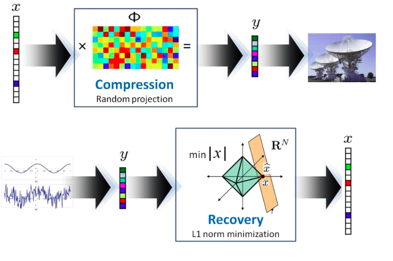
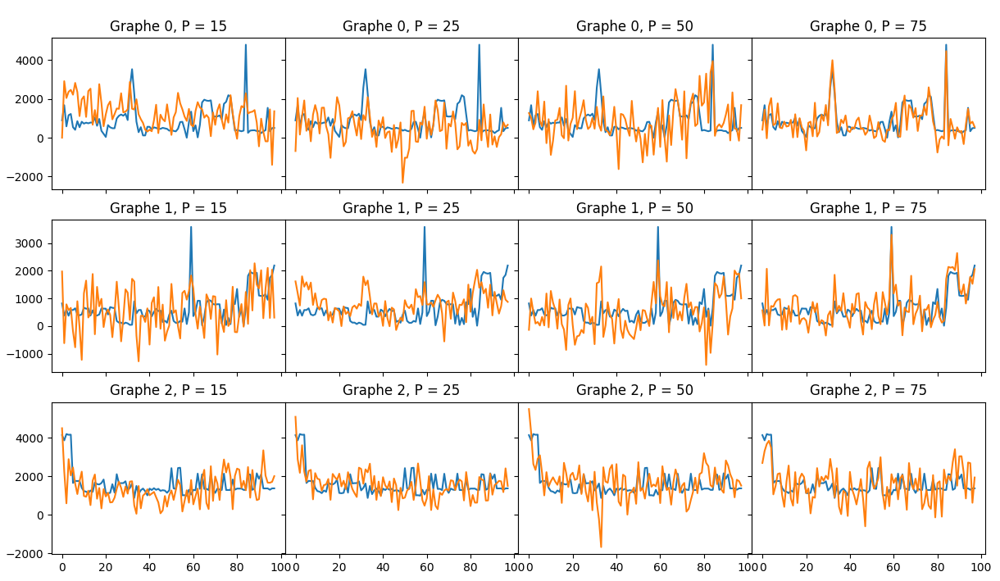
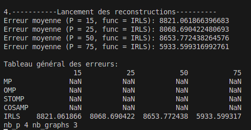
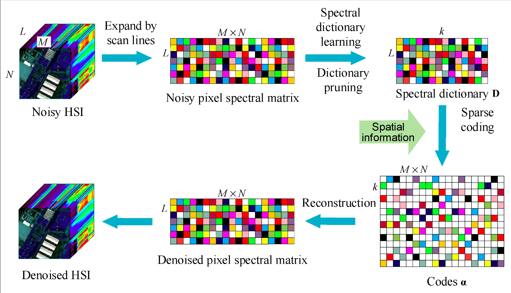

# README pour le Projet Compressive Sensing

Ce projet met en œuvre des techniques de Compressive Sensing, utilisant la parcimonie des signaux pour réduire le nombre de données nécessaires à leur représentation précise. La méthode s'appuie sur une matrice de mesure aléatoire pour convertir le signal original en une forme parcimonieuse, permettant une reconstruction fidèle du signal avec moins de ressources et de temps que les méthodes de compression classiques.



[Rapport du projet](docs/Rapport_projet_Compressive_Sensing.pdf)
## Configuration de l'Environnement
Pour configurer l'environnement nécessaire à l'exécution du projet, suivez ces étapes :

```bash
python3 -m venv .venv            # Crée un environnement virtuel
source .venv/bin/activate        # Active l'environnement virtuel
pip install -r requirements.txt  # Installe les dépendances
```

## Exécution du Programme
Pour lancer le programme principal, utilisez la commande suivante :

```bash
python3 src/main.py
```

## Structure du Projet
Le projet est organisé comme suit :
```
.
├── data             # Dossier pour les données utilisées ou générées
├── src              # Code source du projet
│   ├── Analyse      # Scripts pour l'analyse des résultats
│   ├── Dico_algo    # Algorithmes liés à la gestion des dictionnaires
│   ├── Init_config  # Configuration initiale des paramètres
│   ├── Mesure       # Gestion et implémentation des matrices de mesure
│   ├── Pursuit_algo # Implémentation des algorithmes de poursuite
│   ├── Reconstruct  # Scripts pour la reconstruction des signaux
│   └── main.py      # Script principal
└── tests_Jupyter    # Tests et notebooks Jupyter pour l'expérimentation

```

## Configuration des Paramètres
Pour modifier les paramètres d'exécution du programme, modifiez le fichier situé à :
```
src/Init_config/set_parameters.py
```
Les paramètres incluent les taux de compression et le choix des algorithmes à comparer :
- **Taux de compression** : `liste_P = [15, 25, 50, 75]`
- **Algorithmes** : `liste_func = ["MP", "OMP", "STOMP", "COSAMP", "IRLS"]`

## Résultats


Vous pouvez voir ci-dessous quelques exemples de résultats obtenus :

### Reconstruction de 3 signaux


### Tableau des erreurs de reconstruction:



Ces captures d'écran mettent en évidence non seulement la précision de la reconstruction, mais également l'efficience du processus de Compressive Sensing dans la réduction des données nécessaires tout en maintenant une haute qualité de signal reconstruit.

## Plus en profondeur

Voici un aperçu des processus clés du projet Compressive Sensing :

### Construction du Dictionnaire (Dico_algo)
Le module `Dico_algo` crée et gère des dictionnaires de fonctions de base pour une représentation parcimonieuse des signaux. Ces fonctions sont optimisées pour minimiser l'erreur de reconstruction tout en maximisant la parcimonie.

### Matrice de Mesure (Mesure)
La matrice de mesure réduit la dimensionnalité du signal original tout en préservant l'essentiel de l'information. Le module `Mesure` s'assure que la matrice respecte le critère de Restricted Isometry Property pour éviter une distorsion excessive des signaux.

### Coefficients Alpha (Pursuit_algo)
Les coefficients alpha, calculés par des algorithmes comme Matching Pursuit (MP) et Orthogonal Matching Pursuit (OMP), déterminent les poids des atomes du dictionnaire pour la reconstruction du signal. Le module `Pursuit_algo` gère cette sélection d'atomes.

### Reconstruction du Signal (Reconstruct)
Le module `Reconstruct` synthétise le signal à partir des coefficients alpha, recréant le signal original à partir de sa forme parcimonieuse avec une haute fidélité.

Pour plus de détails, consultez le diagramme et la documentation ci-dessous :



### Ressources Complémentaires
Pour une analyse détaillée, consultez le document PDF :
[Documentation Détaillée du Projet Compressive Sensing](docs/Rapport_projet_Compressive_Sensing.pdf)